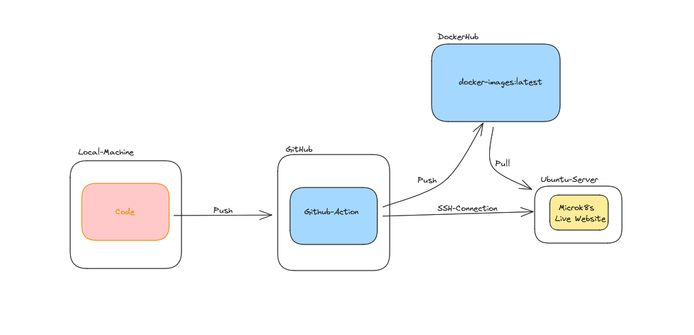
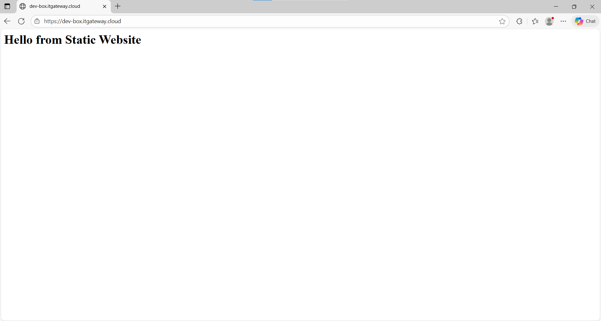
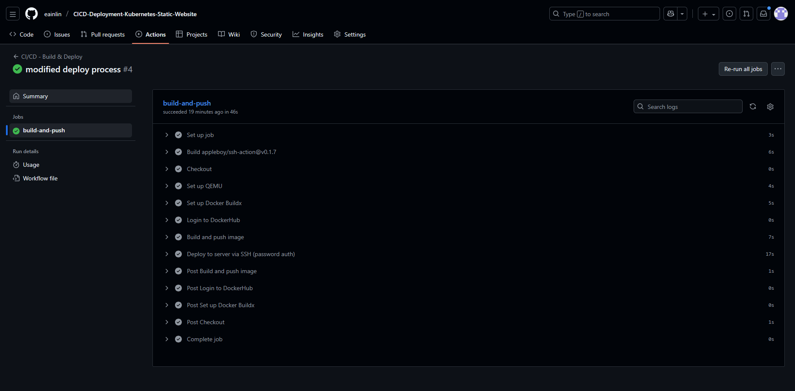
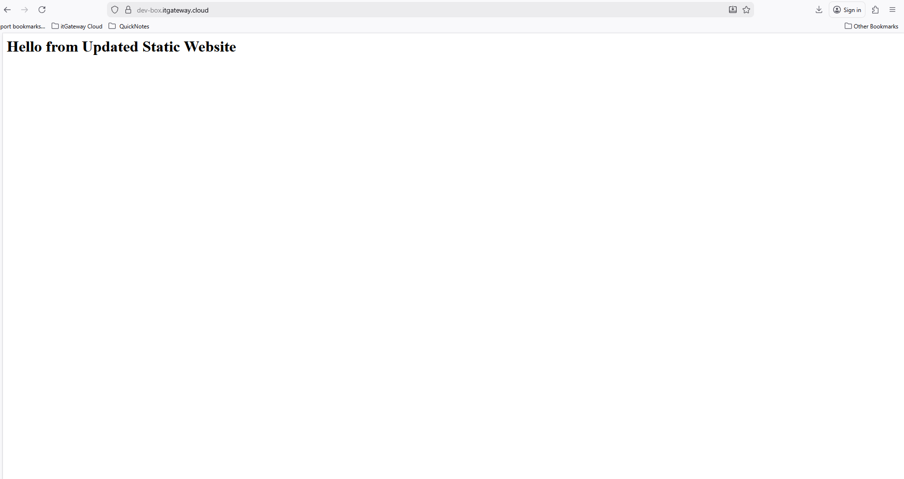

# Kubernets Static Website CI/CD Process with Github Action

### Architecture


---

This repository/template shows a simple CI/CD pipeline for a **static website** using:

* **MicroK8s** on an Ubuntu public server (single-node cluster)
* **DockerHub** to store container images
* **GitHub Actions** to build and push images and trigger deployment
* **Ingress + cert-manager** to provide HTTPS (Let's Encrypt)

The instructions assume a public domain (e.g. `example.com`) pointing to your Ubuntu server's public IP.

---

## Prerequisites (server & local)

* Ubuntu 22.04/24.04 server with a public IP and a DNS A record pointing to it (e.g. `site.example.com`).
* User with `sudo` on the server (we'll call it `ubuntu`).
* Ports 80 and 443 open in firewall/security group.
* GitHub repository for your static site.
* DockerHub account and repository (e.g. `dockerhubuser/static-site`).
* GitHub Actions secrets: `DOCKERHUB_USERNAME`, `DOCKERHUB_TOKEN`, `SSH_PASSWORD`, `SSH_USER` (e.g. `ubuntu`), `SSH_HOST` (server IP or hostname), `SSH_PORT` (optional, default 22).

---

## Repo layout (suggested)

```
/ (repo root)
├─ Dockerfile
├─ .github/workflows/
│  └─ deploy.yml
├─ k8s/
│  ├─ deployment.yaml
│  ├─ service.yaml
│  └─ ingress.yaml
├─ site/index.html 
└─ README.md
```

---

## Dockerfile (simple static site)

Use an nginx-based image that serves `/usr/share/nginx/html`:

```dockerfile
# Dockerfile
FROM nginx:stable-alpine
COPY site/ /usr/share/nginx/html/
# optional: expose port
EXPOSE 80
```

Build locally to test:

```bash
docker build -t dockerhubuser/static-site:dev .
docker run --rm -p 8080:80 dockerhubuser/static-site:dev
# browse http://localhost:8080
```

---

## MicroK8s server bootstrap (on Ubuntu public server)

Run these on the Ubuntu host (replace `<user>` with your username if needed):

```bash
# install microk8s
sudo snap install microk8s --classic --channel=1.27/stable
# add your user to microk8s group
sudo usermod -a -G microk8s $USER
sudo chown -f -R $USER ~/.kube
# logout/login or new shell needed for group changes

# enable basic add-ons
sudo microk8s enable dns ingress registry cert-manager

# confirm components are running
sudo microk8s kubectl get pods -n cert-manager
sudo microk8s kubectl get pods -n ingress
```

> If `microk8s` commands need root: use `microk8s` directly (on many systems `microk8s kubectl` is available without sudo). Example: `microk8s kubectl get nodes`.

---

## cert-manager: ClusterIssuer for Let's Encrypt (staging and production)

Create `k8s/cluster-issuer.yaml` and apply. Example using HTTP-01 solver (Ingress must be reachable via port 80):

```yaml
apiVersion: cert-manager.io/v1
kind: ClusterIssuer
metadata:
  name: letsencrypt-staging
spec:
  acme:
    email: your-email@example.com
    server: https://acme-staging-v02.api.letsencrypt.org/directory
    privateKeySecretRef:
      name: letsencrypt-staging
    solvers:
      - http01:
          ingress:
            class: nginx

---

apiVersion: cert-manager.io/v1
kind: ClusterIssuer
metadata:
  name: letsencrypt-prod
spec:
  acme:
    email: your-email@example.com
    server: https://acme-v02.api.letsencrypt.org/directory
    privateKeySecretRef:
      name: letsencrypt-prod
    solvers:
      - http01:
          ingress:
            class: nginx
```

Apply:

```bash
microk8s kubectl apply -f k8s/cluster-issuer.yaml
```

---

## Kubernetes manifests (k8s/)

### Deployment + Service (`k8s/deployment.yaml`, `k8s/service.yaml`)

```yaml
# k8s/deployment.yaml
apiVersion: apps/v1
kind: Deployment
metadata:
  name: static-site
spec:
  replicas: 1
  selector:
    matchLabels:
      app: static-site
  template:
    metadata:
      labels:
        app: static-site
    spec:
      containers:
        - name: static-site
          image: dockerhubuser/static-site:latest # updated by deploy step
          ports:
            - containerPort: 80

---
# k8s/service.yaml
apiVersion: v1
kind: Service
metadata:
  name: static-site
spec:
  selector:
    app: static-site
  ports:
    - protocol: TCP
      port: 80
      targetPort: 80
  type: ClusterIP
```

### Ingress with cert-manager annotations (`k8s/ingress.yaml`)

Replace `site.example.com` with your domain.

```yaml
apiVersion: networking.k8s.io/v1
kind: Ingress
metadata:
  name: static-site-ingress
  annotations:
    cert-manager.io/cluster-issuer: letsencrypt-prod
spec:
  ingressClassName: public
  tls:
  - hosts:
    - dev-box.itgateway.cloud
    secretName: static-site-tls
  rules:
  - host: dev-box.itgateway.cloud
    http:
      paths:
      - path: /
        pathType: Prefix
        backend:
          service:
            name: static-site
            port:
              number: 80
```

Apply the k8s manifests once the Docker image is available and pushed.

```bash
microk8s kubectl apply -f k8s/deployment.yaml
microk8s kubectl apply -f k8s/service.yaml
microk8s kubectl apply -f k8s/ingress.yaml
```

Check cert requests:

```bash
microk8s kubectl get certificaterequests,certificates -A
microk8s kubectl describe certificate static-site-tls -n default
```

---

## GitHub Actions Workflow (action-workflows/deploy.yml)

This workflow:

1. Builds the Docker image
2. Pushes to DockerHub
3. SSHes to the Ubuntu server and updates the K8s Deployment image and restarts rollout

```yaml
name: CI/CD - Build & Deploy

on:
  push:
    branches:
      - main

jobs:
  build-and-push:
    runs-on: ubuntu-latest

    steps:
      - name: Checkout
        uses: actions/checkout@v4

      - name: Set up QEMU
        uses: docker/setup-qemu-action@v2

      - name: Set up Docker Buildx
        uses: docker/setup-buildx-action@v3

      - name: Login to DockerHub
        uses: docker/login-action@v2
        with:
          username: ${{ secrets.DOCKERHUB_USERNAME }}
          password: ${{ secrets.DOCKERHUB_TOKEN }}

      - name: Build and push image
        uses: docker/build-push-action@v5
        with:
          context: .
          file: ./Dockerfile
          push: true
          tags: htops/static-web:latest

      - name: Deploy to server via SSH (password auth)
        uses: appleboy/ssh-action@v0.1.7
        with:
          host: ${{ secrets.SSH_HOST }}
          username: ${{ secrets.SSH_USER }}
          password: ${{ secrets.SSH_PASSWORD }}
          port: ${{ secrets.SSH_PORT || 22 }}
          script: |
            echo "Pulling latest Docker image..."
            docker pull htops/static-web:latest || true

            echo "Updating Kubernetes deployment..."
            microk8s kubectl set image deployment/static-site static-web=htops/static-web:latest --record || true

            echo "Rolling out deployment..."
            microk8s kubectl rollout restart deployment/static-site
            microk8s kubectl rollout status deployment/static-site --timeout=120s
```
---
### Verify Our Pipeline if it is ok or not

- Access the website the current state from your browser

- Edit something in index.html and push to github
- See the Pipeline Process

- Once the pipeline job is done, Access again the website from your browser
- It will show your changes:


***The lab is done, Thank you!!!***

***Created by Htoo Eain Lin***


